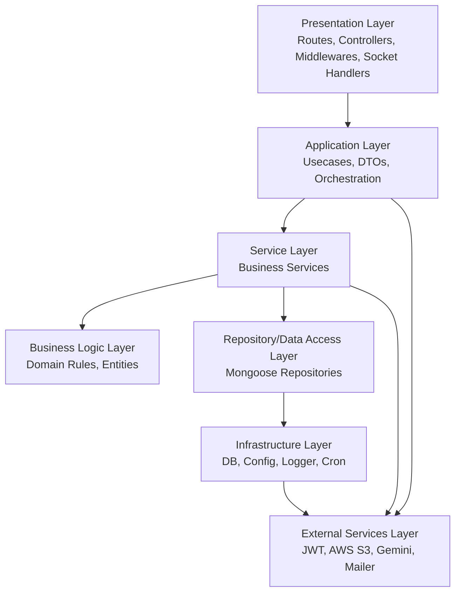

# Layered Architecture

## Diagram

## Dependency Direction

- Allowed direction: P -> A -> S -> D and S -> R -> I
- External access: A and S can call E; I can call E for adapters/config
- Forbidden: lower layers calling upper layers

## Layer Call Rules

- Presentation can call: Application only.
- Application can call: Service, External (for cross-cutting, orchestration).
- Service can call: Business Logic, Repository, External.
- Business Logic can call: nothing outside itself.
- Repository can call: Infrastructure only.
- Infrastructure can call: External (drivers/adapters).
- External is leaf: no calls inward.

## Layer Responsibilities

- Presentation Layer: nhan request HTTP/Socket, validate input co ban, map DTO, tra response, khong chua business logic.
- Application Layer: dieu phoi usecase, gom luong xu ly, phoi hop service va transaction logic.
- Service Layer: chua xu ly nghiep vu muc cao, goi repository va external services.
- Business Logic Layer: rule nghiep vu cot loi, entity behavior, khong phu thuoc ha tang.
- Repository/Data Access Layer: truu tuong truy cap DB, an chi tiet Mongoose.
- Infrastructure Layer: ket noi DB, config, logger, cron, cache, wiring.
- External Services Layer: tuong tac he thong ngoai (JWT, AWS S3, Gemini, Mailer).
